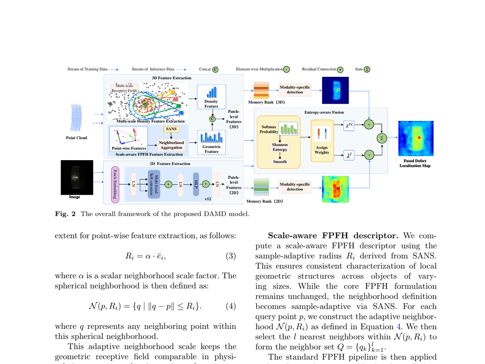

# DAMD: Density-Augmented RGB-3D Fusion for Subtle Industrial Defect Detection

This repository contains the official implementation used in the paper under review at *The Visual Computer*.

Code, evaluation scripts, configuration files, and reproducibility documentation are publicly available in this repository. 　

## Graphical abstract / pipeline overview

The existing DAMD framework figure from the manuscript is provided below as a graphical-abstract-style overview of the released pipeline.



## Why DAMD is useful

DAMD is useful for industrial anomaly detection because it remains lightweight, avoids dependence on a heavy pretrained 3D backbone in the main evaluation setting, improves subtle defect detection on public RGB-3D benchmarks, provides interpretable modality-weight behavior through entropy-aware fusion analysis, and can be reproduced on public datasets using the released code, scripts, and configuration files.

## What is included

- `main.py`: primary evaluation entrypoint for DAMD.
- `configs/`: reproducibility configs for MVTec 3D-AD and Eyecandies.
- `scripts/run_reproduction.py`: one-command reproduction wrapper.
- `scripts/build_memory_bank.py`: public memory-bank construction wrapper.
- `scripts/reproduce_mvtec3d.sh` and `scripts/reproduce_eyecandies.sh`: dataset-specific wrappers.
- `REPRODUCIBILITY.md`: exact reproduction workflow and checklist.
- `experiments/revision/`: scripts for revision experiments (EAF analysis, robustness, efficiency).
- `checkpoints/README.md`: checkpoint manifest and placement rules.

 

## Environment setup

We recommend reproducing the experiments with the exact environment captured from the original server.

### Option A: Conda environment (recommended)

```bash
conda env create -f environment.yml
conda activate damd
```

### Option B: Pip lockfile

```bash
python -m venv .venv
source .venv/bin/activate
pip install -r requirements-lock.txt
```

The original experiments were run with Python 3.8.20, torch 1.10.0, torchvision 0.11.1, timm 0.9.12, and open3d 0.10.0.0.

## Datasets

### MVTec 3D-AD

- Official source: <https://www.mvtec.com/company/research/datasets/mvtec-3d-ad>
- DAMD uses the same training/testing split protocol as M3DM on the official MVTec 3D-AD categories.
- Preprocessing is performed in place:

```bash
python utils/preprocessing.py /path/to/mvtec3d
```

### Eyecandies

- Official source: <https://eyecan-ai.github.io/eyecandies/>
- DAMD uses the same training/testing split protocol as M3DM on the official Eyecandies release.
- Convert the raw release into the DAMD directory layout with:

```bash
python utils/preprocess_eyecandies.py \
  --dataset_path /path/to/Eyecandies \
  --target_dir /path/to/eyecandies_preprocessed
```

The datasets are not redistributed here because they remain subject to their original licenses and access conditions.

## Checkpoints

Place the required checkpoints under `checkpoints/`:

- `checkpoints/dino_vitbase8_pretrain.pth`
- `checkpoints/uff_pretrain.pth` (only required when UFF-based runs are enabled)

Public release assets:

- `dino_vitbase8_pretrain.pth`: <https://github.com/tzgp/DAMD/releases/download/v1.0.0/dino_vitbase8_pretrain.pth>
- `uff_pretrain.pth`: <https://github.com/tzgp/DAMD/releases/download/v1.0.0/uff_pretrain.pth>

See `checkpoints/README.md` and `checkpoints/checksums.sha256` for provenance and checksum details.

## One-command reproduction

### MVTec 3D-AD

```bash
bash scripts/reproduce_mvtec3d.sh /path/to/mvtec3d
```

### Eyecandies

```bash
bash scripts/reproduce_eyecandies.sh /path/to/Eyecandies /path/to/eyecandies_preprocessed
```

These wrappers validate required paths, optionally preprocess the data, and launch the exact config-backed pipeline:

```bash
python scripts/run_reproduction.py --config configs/mvtec3d_reproduction.yaml
python scripts/run_reproduction.py --config configs/eyecandies_reproduction.yaml
```

## Memory-bank construction

To publicly expose the training memory-bank construction path, the repository provides a dedicated wrapper that reuses the same config and feature-extraction pipeline while skipping evaluation:

```bash
python scripts/build_memory_bank.py \
  --config configs/mvtec3d_reproduction.yaml \
  --dataset-root /path/to/mvtec3d \
  --skip-preprocess
```

This command saves per-sample training feature tensors under the configured `save_feature_path` (for example `outputs/feature_cache/mvtec3d`) and is intended as the public memory-bank construction artifact for reproducibility.

## Public benchmark snapshot

The table below is maintained in a leaderboard-style format for the released DAMD configuration on public data. The current verified public snapshot is:

| Dataset | Split protocol | Entry point | Memory-bank artifact | I-AUROC | P-AUROC | AU-PRO | Status |
|:--|:--|:--|:--|--:|--:|--:|:--|
| MVTec 3D-AD | Same setup as M3DM | `configs/mvtec3d_reproduction.yaml` | `scripts/build_memory_bank.py` | 0.954 | 0.993 | 0.969 | fresh-clone verified |
| Eyecandies | Same setup as M3DM | `configs/eyecandies_reproduction.yaml` | `scripts/build_memory_bank.py` | 0.904 | 0.981 | 0.903 | historical server run |

Community-facing benchmark extensions can be added in future releases using the same table structure.

## Main evaluation command

The primary paper setting is:

```bash
python main.py \
  --method_name DINO+FPFH+add+late \
  --dataset_type mvtec3d \
  --dataset_path /path/to/mvtec3d \
  --rgb_backbone_checkpoint checkpoints/dino_vitbase8_pretrain.pth \
  --results_dir results/mvtec3d
```

For Eyecandies, replace `--dataset_type` and `--dataset_path` accordingly.

## Reproducibility artifacts

This repository includes:

- exact environment files (`environment.yml`, `requirements-lock.txt`)
- reproducibility configs (`configs/*.yaml`)
- dataset preprocessing scripts (`utils/preprocessing.py`, `utils/preprocess_eyecandies.py`)
- evaluation entrypoint (`main.py`)
- revision-analysis scripts (`experiments/revision/`)
- checkpoint manifest and checksums (`checkpoints/`)
- reproducibility checklist and reviewer-facing summary (`REPRODUCIBILITY.md`, `REVIEWER_RESPONSE_AND_WORK_SUMMARY.md`)


## Acknowledgements

This repository builds on ideas and components from [3D-ADS](https://github.com/eliahuhorwitz/3D-ADS) and [M3DM](https://github.com/nomewang/M3DM). We thank the original authors for releasing their code.
